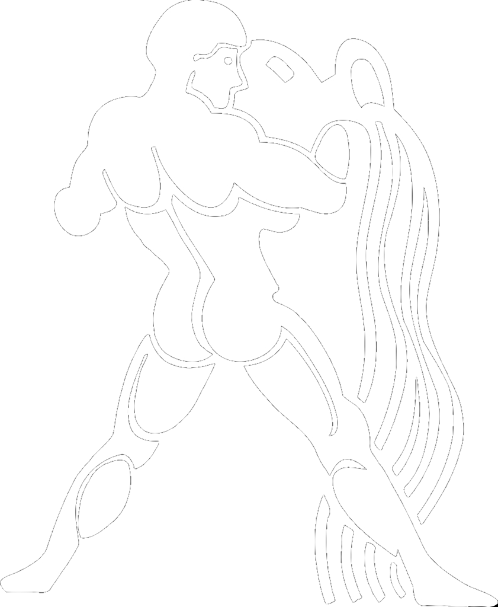
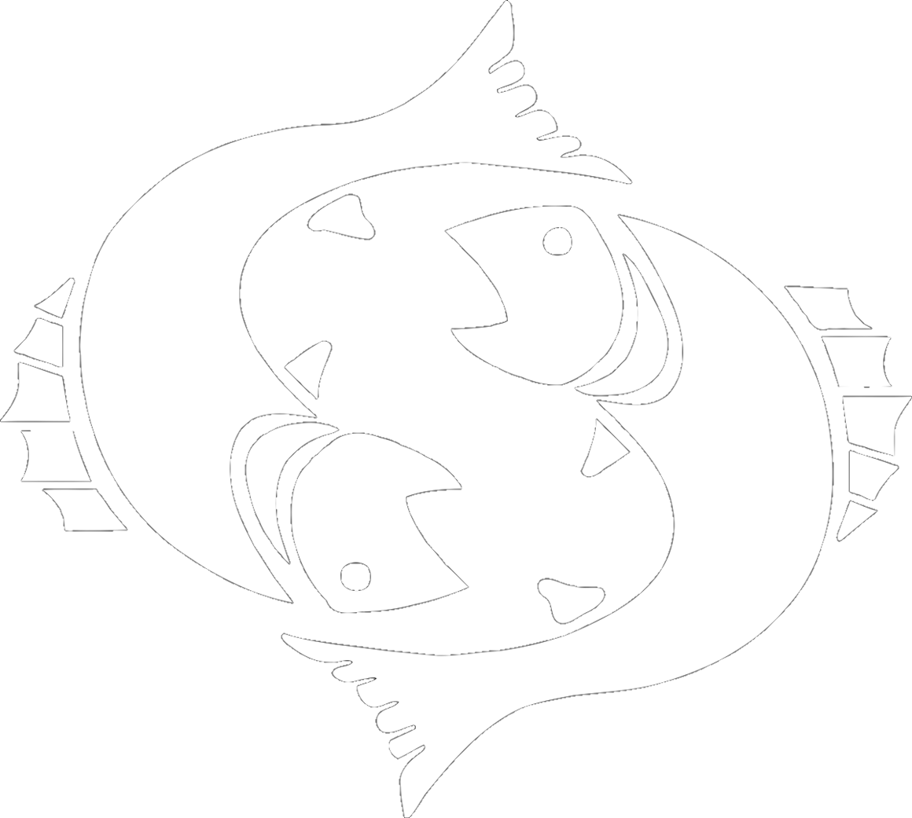

<html lang="pt-br">
  <head>
    <meta charset="UTF-8">
    <meta name="viewport" content="width=device-width, initial-scale=1, maximum-scale=1.0">
    <link rel="stylesheet" href="https://use.fontawesome.com/releases/v5.5.0/css/all.css" integrity="sha384-B4dIYHKNBt8Bc12p+WXckhzcICo0wtJAoU8YZTY5qE0Id1GSseTk6S+L3BlXeVIU" crossorigin="anonymous">
    <title></title>
    
    <body>
       
       

       
      
      
       
 
       
       <h1>Vitor Oliveira</h1>
       
♈♉♊♋♌♍♎♏♐♑♒♓

       

       
 | Astrologia & Tarot |   

       

       <a href="https://vitordev01.netlify.app/?fbclid=PAAabuJGBRlbnt0_ufx4HxXIgGYVpukSn6KGreKbt0Uo8g1FIQOiVgSz7KCbM"><button class="btn-1">
       
       
<strong><i class="fa fa-user" aria-hidden="true"></i>  Sobre Mim</strong>

       
       </button></a>
       
       <a href="https://youtube.com/@FalandoDeAstrologia8"><button class="btn-1">
       
       
<strong><i class="fa fa-video" aria-hidden="true"></i> Canal Falando De Astrologia </strong>

       
       </button></a>
       
       
       <a href="https://wa.me/5524992717594?text=Olá+Gostaria+De+Saber+Mais+Sobre+A+Leitura+Do+Meu+Mapa+Pessoal+De+2023"><button class="btn-1">
       
<strong><i class="fa fa-map" aria-hidden="true"></i>  Leitura Do Mapa Pessoal 2023</strong>

       
       </button></a>
       
       <a href="https://wa.me/5524992717594?text=Olá+Gostaria+De+Saber+Mais+Sobre+A+Leitura+Do+Meu+Mapa+De+Nascimento"><button class="btn-1">
       
<strong><i class="fa fa-child" aria-hidden="true"></i>  Leitura Do Mapa De Nascimento</strong>

       
       </button></a>
       
       <a href="https://wa.me/5524992717594?text=Olá+Gostaria+De+Saber+Mais+Sobre+As+Consultas+Online"><button class="btn-1">
       
<strong><i class="fa fa-headset" aria-hidden="true"></i>  Consulta De Tarot Online</strong>

       
       </button></a>
       
       <a href="https://www.instagram.com/vitorkw89/"><button class="btn-1">
       
<strong><i class="fa fa-heart" aria-hidden="true"></i>  Instagram </strong>

       
       </button></a>
      
       <a href=""><button class="btn-1">
       
<strong><i class="fa fa-book" aria-hidden="true"></i>  Blog Pessoal</strong>

       
       </button></a>
       

       
☉ ☽ ☿ ♀ ⊕ ♁ ♂ ♃ ♄ ♅ ⛢ ♆ ♇

       

        
       
©Vitor Oliveira 2023 - GitHub Pages
 
    </body>
<html>
